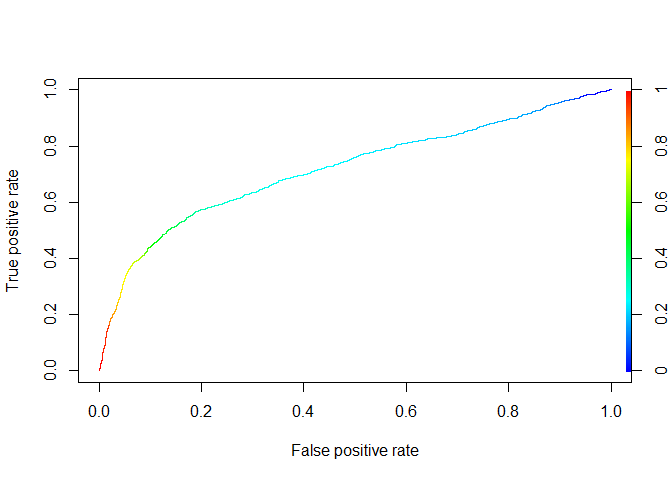

Actividad 10
================

\#\#Cargamos librerías

``` r
library(tidyverse)
```

    ## -- Attaching packages --------------------------------------- tidyverse 1.3.1 --

    ## v ggplot2 3.3.5     v purrr   0.3.4
    ## v tibble  3.1.2     v dplyr   1.0.7
    ## v tidyr   1.1.3     v stringr 1.4.0
    ## v readr   1.4.0     v forcats 0.5.1

    ## -- Conflicts ------------------------------------------ tidyverse_conflicts() --
    ## x dplyr::filter() masks stats::filter()
    ## x dplyr::lag()    masks stats::lag()

``` r
library(e1071)
library(caret)
```

    ## Loading required package: lattice

    ## 
    ## Attaching package: 'caret'

    ## The following object is masked from 'package:purrr':
    ## 
    ##     lift

``` r
library(rstan)
```

    ## Loading required package: StanHeaders

    ## rstan (Version 2.21.2, GitRev: 2e1f913d3ca3)

    ## For execution on a local, multicore CPU with excess RAM we recommend calling
    ## options(mc.cores = parallel::detectCores()).
    ## To avoid recompilation of unchanged Stan programs, we recommend calling
    ## rstan_options(auto_write = TRUE)

    ## Do not specify '-march=native' in 'LOCAL_CPPFLAGS' or a Makevars file

    ## 
    ## Attaching package: 'rstan'

    ## The following object is masked from 'package:tidyr':
    ## 
    ##     extract

``` r
library(rstanarm)
```

    ## Loading required package: Rcpp

    ## This is rstanarm version 2.21.1

    ## - See https://mc-stan.org/rstanarm/articles/priors for changes to default priors!

    ## - Default priors may change, so it's safest to specify priors, even if equivalent to the defaults.

    ## - For execution on a local, multicore CPU with excess RAM we recommend calling

    ##   options(mc.cores = parallel::detectCores())

    ## 
    ## Attaching package: 'rstanarm'

    ## The following object is masked from 'package:rstan':
    ## 
    ##     loo

    ## The following objects are masked from 'package:caret':
    ## 
    ##     compare_models, R2

``` r
library(rsample)
```

    ## 
    ## Attaching package: 'rsample'

    ## The following object is masked from 'package:Rcpp':
    ## 
    ##     populate

    ## The following object is masked from 'package:e1071':
    ## 
    ##     permutations

``` r
library(ROCR)
```

\#\#Cargamos nuestra data

``` r
setwd("D:/Universidad/Minería de datos 2/actividad-ayudantia10")
credit_card <- read.csv("UCI_Credit_Card.csv", sep = ",")
```

\#\#preprocesamiento de datos

``` r
summary(credit_card)
```

    ##        ID          LIMIT_BAL            SEX          EDUCATION    
    ##  Min.   :    1   Min.   :  10000   Min.   :1.000   Min.   :0.000  
    ##  1st Qu.: 7501   1st Qu.:  50000   1st Qu.:1.000   1st Qu.:1.000  
    ##  Median :15000   Median : 140000   Median :2.000   Median :2.000  
    ##  Mean   :15000   Mean   : 167484   Mean   :1.604   Mean   :1.853  
    ##  3rd Qu.:22500   3rd Qu.: 240000   3rd Qu.:2.000   3rd Qu.:2.000  
    ##  Max.   :30000   Max.   :1000000   Max.   :2.000   Max.   :6.000  
    ##     MARRIAGE          AGE            PAY_0             PAY_2        
    ##  Min.   :0.000   Min.   :21.00   Min.   :-2.0000   Min.   :-2.0000  
    ##  1st Qu.:1.000   1st Qu.:28.00   1st Qu.:-1.0000   1st Qu.:-1.0000  
    ##  Median :2.000   Median :34.00   Median : 0.0000   Median : 0.0000  
    ##  Mean   :1.552   Mean   :35.49   Mean   :-0.0167   Mean   :-0.1338  
    ##  3rd Qu.:2.000   3rd Qu.:41.00   3rd Qu.: 0.0000   3rd Qu.: 0.0000  
    ##  Max.   :3.000   Max.   :79.00   Max.   : 8.0000   Max.   : 8.0000  
    ##      PAY_3             PAY_4             PAY_5             PAY_6        
    ##  Min.   :-2.0000   Min.   :-2.0000   Min.   :-2.0000   Min.   :-2.0000  
    ##  1st Qu.:-1.0000   1st Qu.:-1.0000   1st Qu.:-1.0000   1st Qu.:-1.0000  
    ##  Median : 0.0000   Median : 0.0000   Median : 0.0000   Median : 0.0000  
    ##  Mean   :-0.1662   Mean   :-0.2207   Mean   :-0.2662   Mean   :-0.2911  
    ##  3rd Qu.: 0.0000   3rd Qu.: 0.0000   3rd Qu.: 0.0000   3rd Qu.: 0.0000  
    ##  Max.   : 8.0000   Max.   : 8.0000   Max.   : 8.0000   Max.   : 8.0000  
    ##    BILL_AMT1         BILL_AMT2        BILL_AMT3         BILL_AMT4      
    ##  Min.   :-165580   Min.   :-69777   Min.   :-157264   Min.   :-170000  
    ##  1st Qu.:   3559   1st Qu.:  2985   1st Qu.:   2666   1st Qu.:   2327  
    ##  Median :  22382   Median : 21200   Median :  20089   Median :  19052  
    ##  Mean   :  51223   Mean   : 49179   Mean   :  47013   Mean   :  43263  
    ##  3rd Qu.:  67091   3rd Qu.: 64006   3rd Qu.:  60165   3rd Qu.:  54506  
    ##  Max.   : 964511   Max.   :983931   Max.   :1664089   Max.   : 891586  
    ##    BILL_AMT5        BILL_AMT6          PAY_AMT1         PAY_AMT2      
    ##  Min.   :-81334   Min.   :-339603   Min.   :     0   Min.   :      0  
    ##  1st Qu.:  1763   1st Qu.:   1256   1st Qu.:  1000   1st Qu.:    833  
    ##  Median : 18105   Median :  17071   Median :  2100   Median :   2009  
    ##  Mean   : 40311   Mean   :  38872   Mean   :  5664   Mean   :   5921  
    ##  3rd Qu.: 50191   3rd Qu.:  49198   3rd Qu.:  5006   3rd Qu.:   5000  
    ##  Max.   :927171   Max.   : 961664   Max.   :873552   Max.   :1684259  
    ##     PAY_AMT3         PAY_AMT4         PAY_AMT5           PAY_AMT6       
    ##  Min.   :     0   Min.   :     0   Min.   :     0.0   Min.   :     0.0  
    ##  1st Qu.:   390   1st Qu.:   296   1st Qu.:   252.5   1st Qu.:   117.8  
    ##  Median :  1800   Median :  1500   Median :  1500.0   Median :  1500.0  
    ##  Mean   :  5226   Mean   :  4826   Mean   :  4799.4   Mean   :  5215.5  
    ##  3rd Qu.:  4505   3rd Qu.:  4013   3rd Qu.:  4031.5   3rd Qu.:  4000.0  
    ##  Max.   :896040   Max.   :621000   Max.   :426529.0   Max.   :528666.0  
    ##  default.payment.next.month
    ##  Min.   :0.0000            
    ##  1st Qu.:0.0000            
    ##  Median :0.0000            
    ##  Mean   :0.2212            
    ##  3rd Qu.:0.0000            
    ##  Max.   :1.0000

``` r
credit_card$ID <- NULL
credit_card$SEX <- factor(credit_card$SEX, levels=1:2, labels=c("Male", "Female"))
credit_card$EDUCATION <- as.factor(credit_card$EDUCATION)
credit_card$MARRIAGE <- as.factor(credit_card$MARRIAGE)
credit_card$default.payment.next.month <- factor(credit_card$default.payment.next.month, levels = 0:1, labels=c("No", "Yes"))
```

\#\#Método Bayesiano

``` r
set.seed(123)
sample <- sample(1:nrow(credit_card), .8*30000)
trainData <- credit_card[sample,]
testData <-  credit_card[-sample,]
modelo_nb <- naiveBayes(default.payment.next.month~SEX+MARRIAGE+AGE+PAY_0+PAY_6+BILL_AMT1+BILL_AMT6+PAY_AMT1+PAY_AMT6, trainData, laplace=1)
pred_nb <- predict(modelo_nb, newdata = testData)
confusionMatrix(data=pred_nb, reference = testData$default.payment.next.month)
```

    ## Confusion Matrix and Statistics
    ## 
    ##           Reference
    ## Prediction   No  Yes
    ##        No  4211  710
    ##        Yes  499  580
    ##                                           
    ##                Accuracy : 0.7985          
    ##                  95% CI : (0.7881, 0.8086)
    ##     No Information Rate : 0.785           
    ##     P-Value [Acc > NIR] : 0.005443        
    ##                                           
    ##                   Kappa : 0.3654          
    ##                                           
    ##  Mcnemar's Test P-Value : 1.545e-09       
    ##                                           
    ##             Sensitivity : 0.8941          
    ##             Specificity : 0.4496          
    ##          Pos Pred Value : 0.8557          
    ##          Neg Pred Value : 0.5375          
    ##              Prevalence : 0.7850          
    ##          Detection Rate : 0.7018          
    ##    Detection Prevalence : 0.8202          
    ##       Balanced Accuracy : 0.6718          
    ##                                           
    ##        'Positive' Class : No              
    ## 

\#\#Graficamos

``` r
pred_test_nb <- predict(modelo_nb, newdata = testData, type="raw")
p_test_nb <- prediction(pred_test_nb[,2], testData$default.payment.next.month)
perf_nb <- performance(p_test_nb, "tpr", "fpr")
plot(perf_nb, colorize=T)
```

<!-- -->

``` r
performance(p_test_nb, "auc")@y.values
```

    ## [[1]]
    ## [1] 0.7183349
